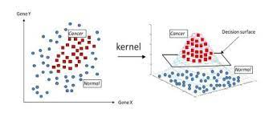
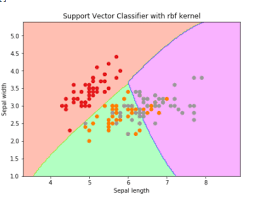

# Problem understanding: Kernel Method by N #
This project aims of introducing the notion of Kernel method. This notion of kernel method is wide used in Machine Learning; It is utilized to model datasets that are non linearly separable. It is almost similar to the notion of Neural Networks, It allows to project the dataset in a space where the datasets are linearly Separable. In kernel Method, we utilize kernel trick procedure. </br>

<!-- 
 -->


  Kernel            |  RBF
:--------------:|:--------:
  |  


<!-- <br> -->
Refer to this [link](https://www.kaggle.com/datasets/oddrationale/mnist-in-csv) to get the data.

# Run the project #
- Understand the Notion of Kernel Method.
- Be able to introduce the kernel trick on project 3 of the last week.
- Implement SVM with the Kernel methods.
- Play around with the different type of kernel in your datasets.
- Compare your results with another type of model, it can be Neural Networks on the same dataset.

</br>

## Create virtual environment ##

```
$ conda create -n yourenvname
```
## Activate your environment ##

```
$ conda activate yourenvname
```

## Requirement installations ##
To run this, make sure to install all the requirements by:

```
$ conda install --file requirements.txt
```
# Training the model #

```
$ python3 main.py
```
## Example of running models ##

```
$ python3 main.py
```

```
$ python3 main.py
```

# Author #
<div style="display:flex;align-items:center">

<div style="display:flex;align-items:center">
    <div>
        <h5> <a href='..'> Mouhamadou Bamba DIOP </a> </h5> 
        <h5> <a href='..'> Abdou Niang </a> </h5> 
        <h5> <a href='..'> Fibi Annan Metiki </a> </h5> 
        <h5> <a href='..'> Gilda Rech </a> </h5> 
</div>